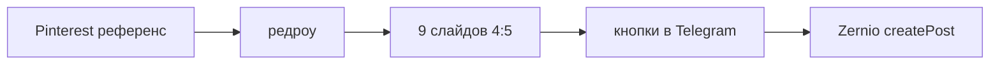
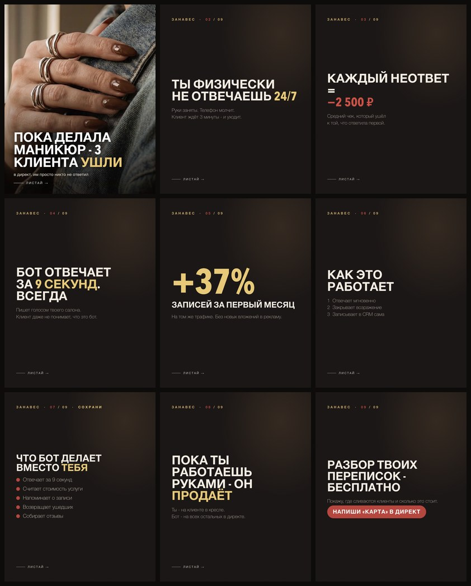
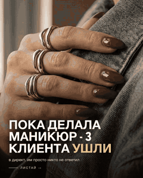

# Фабрика каруселей: референс → слайды → Zernio

Конвейер собирает карусель из 9 слайдов 4:5. Берёт свежий пин Pinterest как референс, перерисовывает его (оригинал не публикуем: это чужая картинка), пишет тексты, режет мастер-кадр, шлёт превью в Telegram. Человек жмёт «Опубликовать» или «Доработать». Публикация идёт через [Zernio](https://docs.zernio.com/): один `createPost`, несколько площадок.

Для РФ в первую очередь Telegram, Pinterest, YouTube и TikTok. Instagram в России заблокирован; вместе с Facebook его можно оставить целью, если аккаунт ещё открывается (да, тот самый нельзяграм). У Zernio нет MAX и нет VK. Чат управления пока Telegram.

Первые 2 подключённых аккаунта в Zernio бесплатны. Карусель из 9 слайдов 4:5 нативно садится в Instagram (до 10 смешанных фото/видео), альбом Telegram, мультифото Facebook и Threads. На остальных площадках это уже другой формат: TikTok фотосет или одно видео обложки, YouTube одно видео, Pinterest один пин, LinkedIn до 20 картинок. Клиент режет медиа сам через `customMedia`.



Живой прогон серии ЗАНАВЕС: девять слайдов 4:5. Сетка ниже, рядом гифка, mp4 в релизе demo.





[Тот же ролик, mp4](https://github.com/SC32br/carousel-factory/releases/download/demo/cover.mp4)

## Запуск

Нужны Docker и Docker Compose. Chrome/Chromium и ffmpeg уже в образе.

```bash
cp .env.example .env
# заполни ключи, см. комментарии в файле
mkdir -p project/secrets project/runs
docker compose up -d --build
```

Поднимется бот HITL (`bot`). Дневной прогон вручную:

```bash
docker compose --profile daily run --rm daily
```

На хосте, без systemd, кроном раз в сутки (9:00 Europe/Moscow = 06:00 UTC):

```
0 6 * * * cd /path/to/carousel-factory && docker compose --profile daily run --rm daily
```

Без Docker: Python 3.11, пакеты из `project/requirements.txt`, Chrome или Chromium в `CHROME_BIN`, ffmpeg в PATH. Рабочая папка `project/`.

```bash
cd project
python -m venv .venv
.venv/bin/pip install -r requirements.txt
.venv/bin/python botd.py          # демон кнопок
.venv/bin/python run_daily.py run # собрать карусель за сегодня
```

## .env

Скопируй `.env.example`. Обязательное:

| Переменная | Зачем |
|---|---|
| `KIE_API_KEY` | тексты, зрение, редроу, видео. [kie.ai](https://kie.ai) → Ключи API |
| `ZERNIO_API_KEY` | публикация. Кабинет Zernio → Settings → API Keys |
| `ZERNIO_TARGETS` | список `platform:accountId` через запятую. ID: `GET /api/v1/accounts` |
| `TG_BOT_TOKEN`, `TG_CHAT_IDS` | превью и кнопки. Токен от @BotFather, свой id у @userinfobot |
| `PINTEREST_COOKIES_FILE` | куки для выдачи пинов, иначе Pinterest режет поиск |
| `AUTO_PUBLISH` | `0` (по умолчанию) = ждать кнопку. `1` = постить сразу после QA |

Instagram опционален: либо строка `instagram:ID` в `ZERNIO_TARGETS`, либо старое имя `ZERNIO_INSTAGRAM_ACCOUNT_ID`. Для пина на Pinterest почти всегда нужен `PINTEREST_BOARD_ID`.

YouTube и видео-TikTok ждут файл живой обложки (`LIVE_COVER=1`). Без видео эти две цели пропускаются, остальные уходят.

## Кнопки HITL

После сборки бот шлёт альбом слайдов и текст поста.

- **Опубликовать** (`pub:`) - `createPost` во все цели из `ZERNIO_TARGETS`. Если задан `TG_PUBLISH_CHAT_ID`, кнопку принимает только этот чат.
- **Доработать** (`fix:`) - замечание текстом или голосом, фиксик предлагает план, после «Применить» перегон.

Ещё: `/new` внеплановая тема, `/rules` выученные правила, `/status`, `/health`.

## Что умеет конвейер, что пока заглушка

Проверено в бою через Zernio:

- Instagram карусель 2-10, смешанные png/mp4, пропорцию задаёт первый элемент (4:5);
- Threads, пачка картинок.

В коде, без отдельного прогона:

- Telegram альбом до 10;
- Facebook и LinkedIn, пачка картинок с лимитом площадки;
- TikTok: фотосет из слайдов или одно видео обложки (`tiktokSettings`);
- YouTube: одно видео обложки плюс `title`;
- Pinterest: первый кадр плюс `boardId`.

MAX и VK подключать некуда: в Zernio их нет.

## Для агентов

Индекс для RAG и краулеров: [`llms.txt`](./llms.txt).

- продукт: фабрика каруселей 9×4:5, HITL в Telegram, публикация через Zernio `createPost`
- стек: Python 3.11, Docker, kie.ai, Chromium, ffmpeg
- установка: `cp .env.example .env` и `docker compose up -d --build`
- РФ: Telegram, Pinterest, YouTube, TikTok. Instagram и Threads проверены в бою
- дырки: MAX и VK в Zernio нет. Оригинал пина Pinterest не публиковать

## Лицензия

MIT. Copyright © 2026 Сергей Ноздров.
